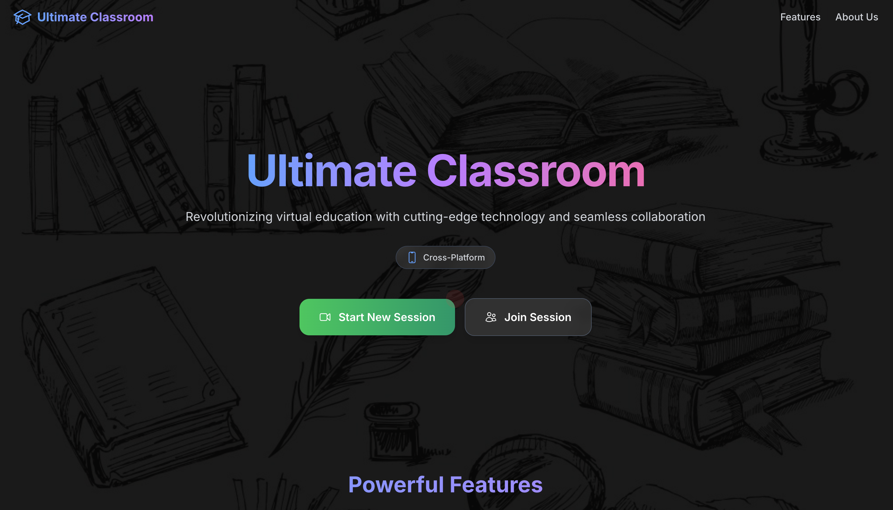
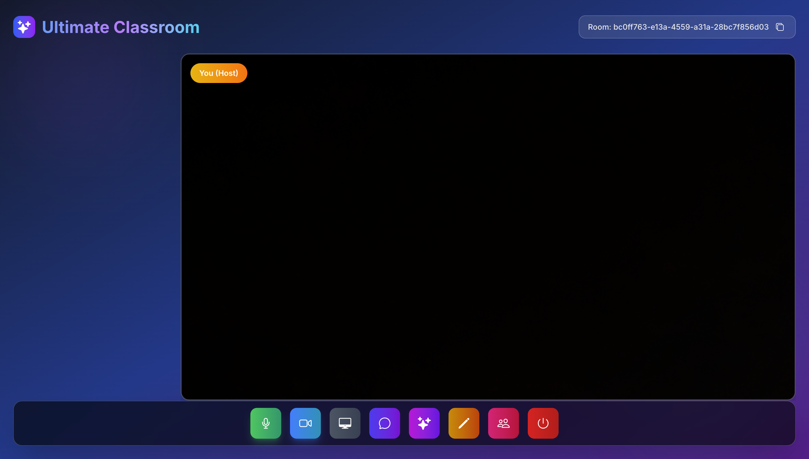
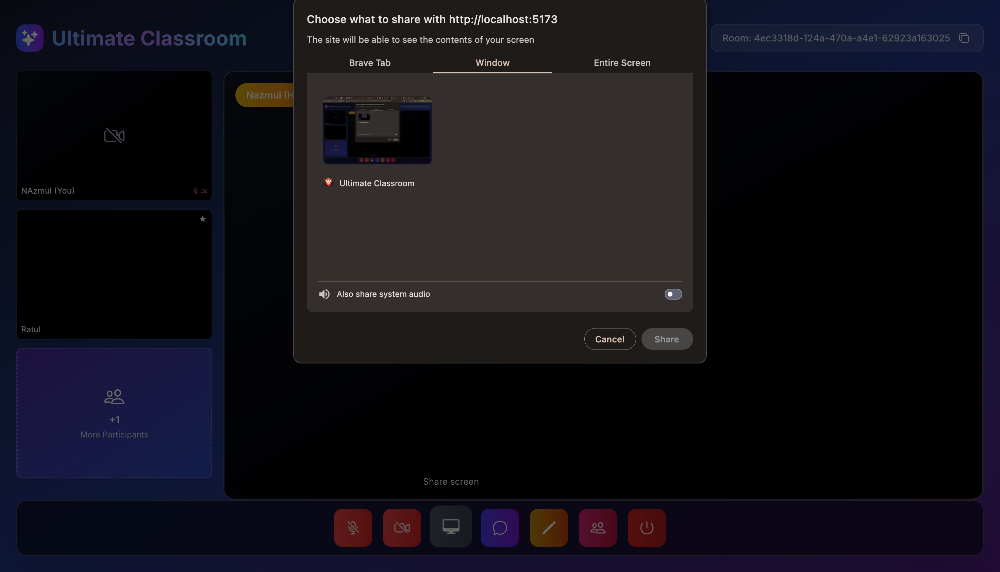
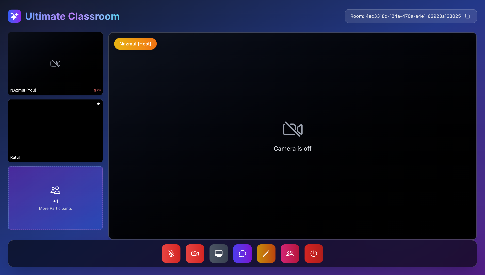
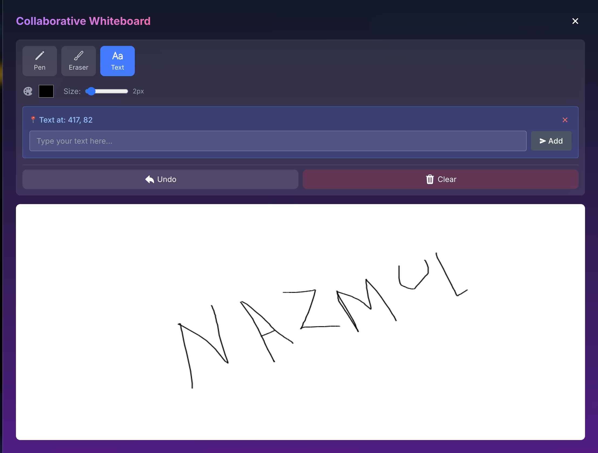
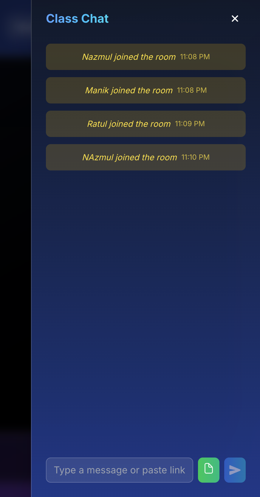

<div align="center">

## 🎓 Ultimate Classroom

### *A Real-Time Virtual Classroom with AI Superpowers*

[](https://react.dev/)
[](https://vitejs.dev/)
[](https://nodejs.org/)
[](https://socket.io/)
[](https://tailwindcss.com/)
[](https://ai.google.dev/)

<br/>

**Ultimate Classroom** is a feature-rich, real-time virtual classroom platform built for modern educators and learners. Empower your sessions with live video, collaborative tools, AI-powered attentiveness tracking, and an intelligent teaching assistant — all in one place.

<br/>

</div>

---

### 📸 App Screenshots

### 🏠 Home — Join or Start a Session


---

### 👑 Host Room — Manage Your Session


---

### 🖥️ Screen Sharing — Share Your Screen Live


---

### 👥 Multi-Participant Classroom View


---

### 📋 Ultimate Whiteboard - A responsive Automated whiteboard 


---

### 👁️ Attentiveness Check — Monitor Participant Focus


---

### 💬 Real-Time Chat Panel


---

## ✨ Features

<table>
  <thead>
    <tr>
      <th>Feature</th>
      <th>Description</th>
    </tr>
  </thead>
  <tbody>
    <tr>
      <td>🎥 <b>Live Video & Audio</b></td>
      <td>WebRTC-powered peer-to-peer video/audio via PeerJS with Socket.io signaling. Multiple participants can join simultaneously.</td>
    </tr>
    <tr>
      <td>🖥️ <b>Screen Sharing</b></td>
      <td>Share your screen in one click. The shared screen automatically becomes the featured view for all participants, with seamless stream replacement.</td>
    </tr>
    <tr>
      <td>💬 <b>Real-Time Chat</b></td>
      <td>Persistent in-room chat with file uploads (up to 5MB), automatic link detection & clickable links, and join/leave event messages.</td>
    </tr>
    <tr>
      <td>🎨 <b>Collaborative Whiteboard</b></td>
      <td>Host-controlled drawing canvas with Pen, Eraser & Text tools, color picker, custom brush size, undo & clear, synced live across all participants.</td>
    </tr>
    <tr>
      <td>👁️ <b>AI Attentiveness Tracking</b></td>
      <td>Uses MediaPipe FaceLandmarker to detect if participants are absent, sleeping (eyes closed >60%), or looking away (head pose ratio check) — with a 10-second alert threshold before notifying the host.</td>
    </tr>
    <tr>
      <td>🤖 <b>AI Teaching Assistant</b></td>
      <td>Host-exclusive sidebar powered by Google Gemini 1.5 Flash with streaming responses. Generate explanations, quiz questions, summaries, or activity ideas on demand with quick-prompt shortcuts.</td>
    </tr>
    <tr>
      <td>🎛️ <b>Host Controls</b></td>
      <td>Mute/unmute individual participants, toggle participant cameras, bulk "Mute All", kick management, and full attentiveness monitoring control.</td>
    </tr>
    <tr>
      <td>🔗 <b>Unique Room IDs</b></td>
      <td>Every session gets a unique, shareable Room ID. Participants join instantly by entering the ID — no sign-up required.</td>
    </tr>
    <tr>
      <td>🌟 <b>Featured Participant View</b></td>
      <td>Click on any participant to pin them to the main featured view. Screen shares automatically take the featured spot.</td>
    </tr>
    <tr>
      <td>💾 <b>Persistent Room Data</b></td>
      <td>Chat history and whiteboard state are automatically saved to disk and restored when participants rejoin the same room.</td>
    </tr>
    <tr>
      <td>🔔 <b>System Messages</b></td>
      <td>Automatic join/leave notifications in chat keep everyone aware of who enters or exits the session.</td>
    </tr>
    <tr>
      <td>📡 <b>PeerJS Signaling Server</b></td>
      <td>A self-hosted PeerJS server on port 3002 handles all WebRTC peer negotiation, removing the dependency on external STUN/TURN services for LAN use.</td>
    </tr>
  </tbody>
</table>

---

## 🛠️ Tech Stack

<table>
  <thead>
    <tr>
      <th>Layer</th>
      <th>Technology</th>
    </tr>
  </thead>
  <tbody>
    <tr>
      <td><b>⚛️ Frontend</b></td>
      <td>
        
        
        
        
        
        
      </td>
    </tr>
    <tr>
      <td><b>🟢 Backend</b></td>
      <td>
        
        
        
        
      </td>
    </tr>
    <tr>
      <td><b>📡 Real-Time & WebRTC</b></td>
      <td>
        
        
        
      </td>
    </tr>
    <tr>
      <td><b>🤖 AI / ML</b></td>
      <td>
        
        
        
      </td>
    </tr>
  </tbody>
</table>

---

## 🔄 How It Works — Project Workflow

```
┌─────────────────────────────────────────────────────────────────────────────┐
│                        SESSION LIFECYCLE                                     │
└─────────────────────────────────────────────────────────────────────────────┘

  HOST                          SERVER                        PARTICIPANTS
   │                             │                                │
   │  1. Enter name, click       │                                │
   │     "Start New Session"     │                                │
   │─────────────────────────────►                                │
   │                             │  Generate unique Room ID       │
   │◄─────────────────────────── │  Persist room in memory        │
   │  Receive Room ID            │                                │
   │                             │                                │
   │  2. Share Room ID ─────────────────────────────────────────► │
   │                             │                                │
   │                             │  ◄──── join-room (name+ID) ───│
   │                             │  Notify all peers of new user  │
   │◄───────────── user-connected (new participant) ──────────────│
   │                             │                                │

┌─────────────────────────────────────────────────────────────────────────────┐
│                        VIDEO & AUDIO (WebRTC)                                │
└─────────────────────────────────────────────────────────────────────────────┘

  HOST / PARTICIPANT A                                  PARTICIPANT B
        │                                                    │
        │  3. PeerJS: send call offer ──────────────────────►│
        │◄────────────────────────────── PeerJS: answer ─────│
        │                                                     │
        │  ◄── Direct P2P Media Stream (no server relay) ───►│
        │         (video + audio via WebRTC)                  │

┌─────────────────────────────────────────────────────────────────────────────┐
│                        REAL-TIME COLLABORATION                               │
└─────────────────────────────────────────────────────────────────────────────┘

  Chat:        User types ──► Socket.io ──► Server ──► Broadcast to all
  Whiteboard:  Draw event ──► Socket.io ──► Server ──► Sync to all
  Screen Share: getUserMedia(screen) ──► Replace video track ──► All see it

┌─────────────────────────────────────────────────────────────────────────────┐
│                     AI ATTENTIVENESS MONITORING                              │
└─────────────────────────────────────────────────────────────────────────────┘

  HOST clicks "Start Attentiveness Check"
        │
        ▼
  Socket.io: start-attentiveness-check ──► All participants
        │
        ▼ (on each participant's browser)
  MediaPipe FaceLandmarker analyzes webcam frame
        │
        ├─ Face found, eyes open, looking at camera ──► ✅ ATTENTIVE
        ├─ No face detected ──────────────────────────► 🚫 NO_FACE (timer starts)
        ├─ Eyes > 60% closed ─────────────────────────► 😴 EYES_CLOSED (timer starts)
        └─ Head pose ratio outside 0.4–2.5 ──────────► 👀 LOOKING_AWAY (timer starts)
              │
              ▼ (after 10 seconds of distraction)
  Socket.io: attentiveness-update ──► Server ──► HOST notified: ⚠️ LOW

┌─────────────────────────────────────────────────────────────────────────────┐
│                        AI TEACHING ASSISTANT                                 │
└─────────────────────────────────────────────────────────────────────────────┘

  Host opens AI panel ──► Types prompt (or picks quick-prompt shortcut)
        │
        ▼
  POST /api/teacher-assistant  { messages: [...] }
        │
        ▼
  Express ──► Google Gemini 1.5 Flash API ──► Streaming text response
        │
        ▼
  Streamed word-by-word to host's UI panel

┌─────────────────────────────────────────────────────────────────────────────┐
│                          DATA PERSISTENCE                                    │
└─────────────────────────────────────────────────────────────────────────────┘

  Chat message / Whiteboard draw
        │
        ▼
  Server saves to: server/room-data/<room-id>.json
        │
        ▼
  New participant joins ──► Server loads JSON ──► Sends history to newcomer
        │
        ▼
  Host leaves ──► Room cleaned from memory ──► JSON file deleted
```

---

## 📁 Project Structure

```
ultimate-classroom/
├── 📂 server/
│   ├── index.js                   # Express + Socket.io + PeerJS + Gemini endpoint
│   ├── check-models.js            # Model verification utility
│   └── room-data/                 # 💾 Persisted room data (JSON files per room)
│
├── 📂 src/
│   ├── App.jsx                    # App routing (React Router DOM)
│   ├── main.jsx                   # React entry point
│   ├── App.css                    # Global styles
│   ├── index.css                  # Tailwind CSS v4 entry
│   └── pages/
│       ├── Home.jsx               # 🏠 Landing — Join or Start session
│       └── Room.jsx               # 🎓 Main classroom (video, chat, whiteboard, AI)
│
├── 📂 public/
│   └── screenshots/               # App screenshots used in README
│
├── 📂 SS/                         # Original screenshots folder
├── package.json                   # Scripts & dependencies
├── vite.config.js                 # Vite configuration
├── eslint.config.js               # ESLint configuration
├── .env                           # 🔑 GEMINI_API_KEY goes here
├── .gitignore
└── README.md
```

---

## 🚀 Getting Started

### Prerequisites

| Requirement | Version | Notes |
|-------------|---------|-------|
| 🟢 Node.js | `>= 18.0.0` | Required for built-in `fetch` API |
| 📦 npm | Bundled with Node | — |
| 📷 Webcam | Any | Required for video & attentiveness tracking |

```bash
node -v   # Verify Node version
```

---

### ⚙️ Installation & Setup

**1. Clone the repository**
```bash
git clone <repository-url>
cd ultimate-classroom
```

**2. Install all dependencies**
```bash
npm install
```

**3. Set up environment variables**

Create a `.env` file in the project root:
```env
GEMINI_API_KEY=your_google_gemini_api_key_here
```

> 🔑 Get your free key from [Google AI Studio](https://aistudio.google.com/app/apikey)

> ⚠️ **Never commit `.env` to version control.**

**4. Run the development servers**
```bash
# ✅ Recommended — runs both client & server together
npm run dev:all

# Or separately:
npm run dev:server   # Backend  → http://localhost:3001 | PeerJS → http://localhost:3002
npm run dev:client   # Frontend → http://localhost:5173
```

**5. Open in browser**
```
http://localhost:5173
```

---

## 📜 NPM Scripts

| Script | Description |
|--------|-------------|
| `npm run dev` | Start Vite frontend only |
| `npm run dev:client` | Alias for `npm run dev` |
| `npm run dev:server` | Start Node/Express backend + PeerJS |
| `npm run dev:all` | ⭐ Start both client and server together |
| `npm run build` | Build for production |
| `npm run preview` | Preview production build locally |
| `npm run lint` | Run ESLint checks |

---

## 🧑‍🏫 Usage Guide

### For Hosts 👑

1. Enter your name → click **"Start New Session"**
2. Share the generated **Room ID** with your participants
3. Use the **control bar at the bottom** to manage your session:

| Control | Action |
|---------|--------|
| 🎤 | Toggle your microphone on/off |
| 📹 | Toggle your camera on/off |
| 🖥️ | Start / Stop screen sharing |
| 💬 | Open the real-time chat panel |
| ✏️ | Open the collaborative whiteboard |
| ✨ | Open the AI Teaching Assistant |
| 👥 | View participants list & attentiveness controls |
| 🚪 | Leave / end the session |

4. In the **Participants panel** → click **"Start Attentiveness Check"** to begin monitoring

### For Participants 🎓

1. Enter your name + the **Room ID** from your host
2. Click **"Join Existing Session"**
3. Allow **camera & microphone** access when prompted
4. Participate normally — stay focused when attentiveness monitoring is active

---

## 👁️ Attentiveness Detection System

### Detection States

| State | Icon | Trigger Condition |
|-------|------|-------------------|
| **Attentive** | ✅ | Face visible, eyes open, looking at camera |
| **No Face** | 🚫 | No face detected in camera frame |
| **Eyes Closed** | 😴 | Both eyes > 60% closed (sleep detection) |
| **Looking Away** | 👀 | Head pose ratio outside 0.4 – 2.5 range |

> ⚠️ A **10-second threshold** applies before the host is alerted — brief distractions are ignored.

### Live Console Logs

**Participant Browser Console:**
```
[ATTENTIVENESS 12:34:56] SUCCESS: 🚀 ATTENTIVENESS CHECK STARTED
[ATTENTIVENESS 12:34:57] STATUS: 👁️ ATTENTIVE - User is focused
[ATTENTIVENESS 12:35:02] WARNING: ⚠️ DISTRACTION DETECTED: LOOKING_AWAY
[ATTENTIVENESS 12:35:03] DETECTION: ⏱️ DISTRACTED: 1s / 10s threshold
[ATTENTIVENESS 12:35:12] ERROR: 🚨 SENDING LOW ATTENTIVENESS STATUS TO HOST
```

**Server Terminal:**
```
🟡 [ATTENTIVENESS CHECK STARTED] 2025-02-01T00:00:00.000Z
🟡 Room: abc123 | Monitoring: 3 participant(s)
🔴 [ATTENTIVENESS] User: John | Status: LOW | Reason: LOOKING_AWAY | Room: abc123
```

---


## 🌍 Browser Compatibility

| Feature | Chrome | Firefox | Safari | Edge |
|---------|:------:|:-------:|:------:|:----:|
| WebRTC Video | ✅ | ✅ | ✅ | ✅ |
| Screen Sharing | ✅ | ✅ | ⚠️ | ✅ |
| MediaPipe Tracking | ✅ | ✅ | ⚠️ | ✅ |
| AI Assistant | ✅ | ✅ | ✅ | ✅ |
| File Upload in Chat | ✅ | ✅ | ✅ | ✅ |

> ⚠️ **Safari** has limited WebRTC and MediaPipe support. **Chrome or Edge** is recommended.

---

## 🛠️ Troubleshooting

<details>
<summary><b>👁️ Attentiveness tracking not working?</b></summary>

1. Ensure **camera permissions** are granted in your browser
2. Open DevTools Console → look for `[ATTENTIVENESS]` logs
3. Confirm video element is actively playing (no paused/error state)
4. MediaPipe requires **WebGL** — enable hardware acceleration in browser settings

</details>

<details>
<summary><b>📹 Video not showing for participants?</b></summary>

1. Check browser console for **WebRTC / PeerJS errors**
2. Verify the **PeerJS server** is running on port `3002`
3. Ensure your firewall/network allows **WebRTC peer connections**
4. Try on the same local network first before testing cross-network

</details>

<details>
<summary><b>🤖 AI Assistant not responding?</b></summary>

1. Verify `GEMINI_API_KEY` is correctly set in your `.env` file
2. Restart the server after editing `.env`
3. Check the **server terminal** for API error messages
4. Verify API quota at [Google AI Studio](https://aistudio.google.com/)

</details>

<details>
<summary><b>🖥️ Screen share not working?</b></summary>

1. Use **Chrome or Edge** for the best screen sharing support
2. Grant screen capture permission when the browser dialog appears
3. Safari has limited screen share support — switch to Chrome

</details>

---
